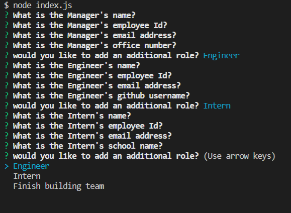

# Team Profile Generator

## Description

This project is a command line application that generates a static webpage that consists of a Team Roster. A Manager can enter a few pieces of information about themselves and their teammates and generate a webpage that contains a roster of their team and some key info and ways to make contact.

## Table of Contents
- [Description](#description)
- [Installation](#installation)
- [Usage](#usage)
- [License](#license)
- [Questions](#questions)

## Installation

To install the app a user needs to install node.js and run “npm install” from the cloned repository.

## Usage

To use the app a user needs to run “node index.js” from the cloned repository with an optional additional argument of the relative path of the target folder you would like the index.html to be generated in. If the argument is left out the index.html will be put in the current folder. 

The user will be prompted through a series of questions. The first set of questions will be for the manager and similar sets of questions will be asked based on the type of role a team member has. When all the information is entered the program will generate an index.html file that can be run in the browser. A video walkthrough can be found at [video Walkthrough](https://drive.google.com/file/d/1X4X82SipsRnuuO-N-TU1QXCTpSl026Mo/view)

A screenshot of the prompts. 

## License

This project is under the MIT license at [MIT](https://opensource.org/licenses/MIT)

## Questions

If you have additional questions please feel free to reach out.

Github: https://www.github.com/abdallajama201

